# RockScissorPaperAgent

The main goal of this project is to create an AI Agent that could be used to predict the winning moves in the Rock-Scissor Paper game, using Machine Learning and Deep Learning Techniques.   
The AI agent will review the opponent's move using an image taken from his hand, classify his move, and propose the winning move.  
The AI Agent will be compared with a Random Agent which will randomly classify each opponent's move in one of the three possible outcomes, thus it will resemble the baseline estimator, expecting to achieve approximately 34% accuracy.
To make the predictions of the winning move from our AI Agent even harder, the Random Agent will apply various transformations in the input image, such as rotation, vertical & horizontal flipping, and added noise.  
For the AI Agent, various workflows were implemented, some of them are listed below:

*   Load RGB images in Grayscale and RGB format.
*   Transform images with operations like rotation, vertical & horizontal flip, and added noise.
*   Resize, scale, and split images in the Train and Test set.
*   Dimensionality Reduction through kernel PCA and LDA.
*   Supervised Learning with Ensemble Models such as Random Forests.
*   Hyperparameter tuning with Grid Search Cross Validation.
*   Supervised Learning with Deep Learning techniques such as CNNs.
*   Transfer Learning and Finetuning with the Xception model
*   Evaluation of models using various metrics in the Validation and Test set. 
*   Creation of a simulated environment for the Rock-Scissor-Paper game and deployment of AI Agent and Random Agent in that environment.

    
`keywords`: Machine Learning, Deep Learning, Supervised Learning, Dimensionality Reduction, Grid Search Hyperparameter Tuning, Cross Validation, Regularization, kernel Principal Component Analysis, Linear Discriminant Analysis, Ensemble Models, Random Forests, Gradient Boosting, Scaling, Normalization, Convolution Neural Networks, Transfer Learning, Finetuning, Data Augmentation

 

# Define the Random Agent

Basic functionality:
1.   Load the requested images from a given path either in rgb or grayscale
2.   Get a random image from test or train dataset
3.   Add white noise in a given image
4.   Perform horizontal or vertical flip with a given probability
 

Original Images

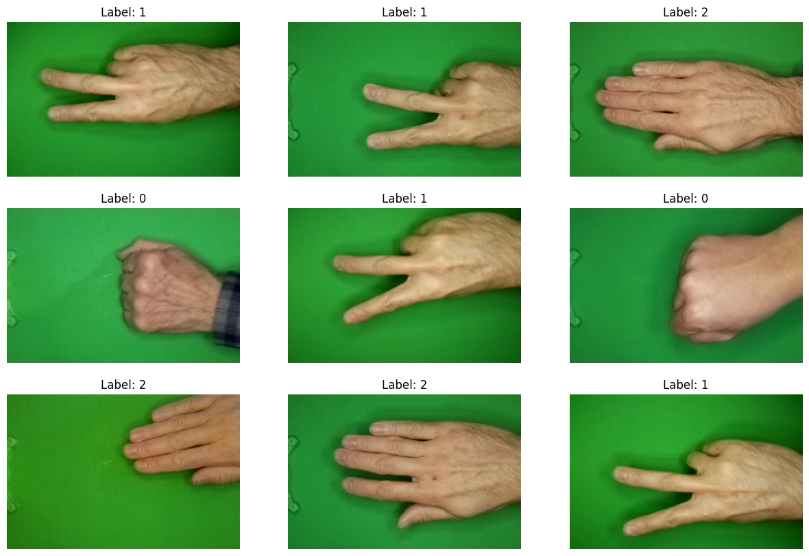

 

Images with Vertical Flip

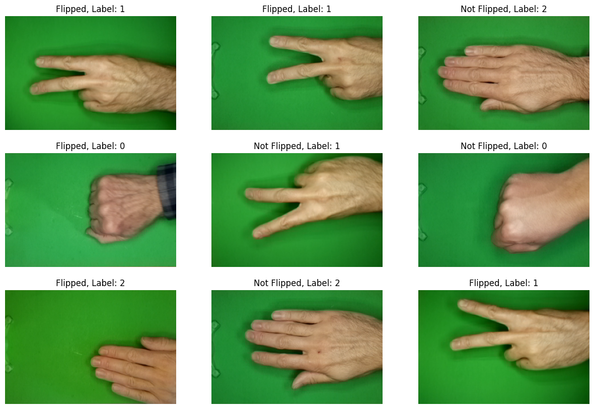

 

Images with Horizontal Flip

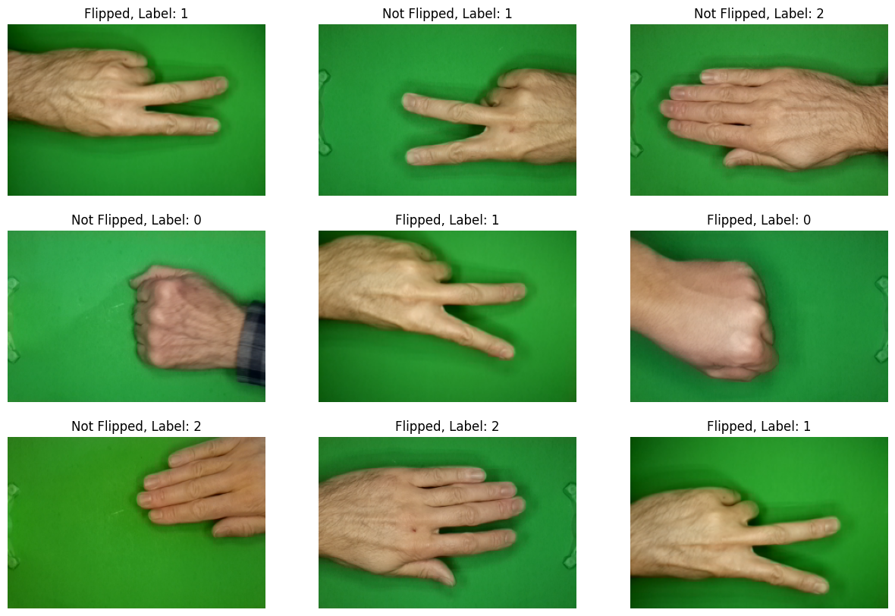

 

Images with Added Noise

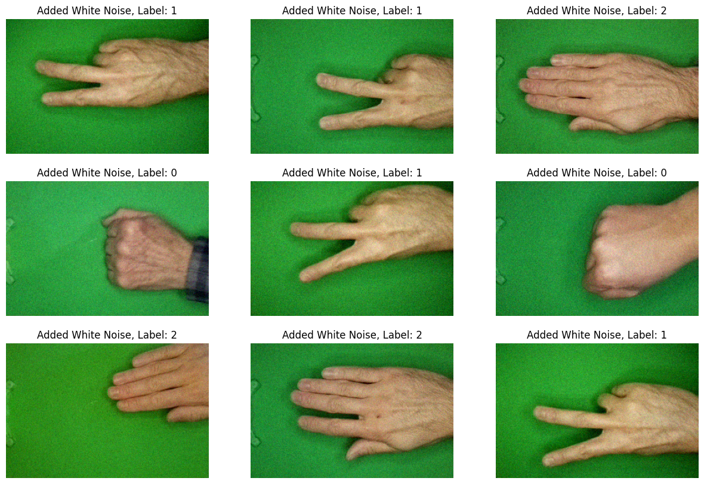

 

# Define the Ensemble Agent

At first we will tried to train various ensemble models and compare their performance in a later stage with Deep Learning models which can handle more efficiently images and transformations in them, such as CNNs.  

The necessary steps for training the listed below:
*    Get the `grayscale version` of the images to reduce the channels to 1
*    Resize images to (50,75) from (200,300) in order to maintain the original images' aspect ratio
*    Use `dimensionality reduction` techniques to reduce the features in each sample.
*    Utilize `ensemble models` like Random Forests and Gradient Boosting as the classifier of our Agent.

 

Accuracy of Ensemble Models from GridSearchCV

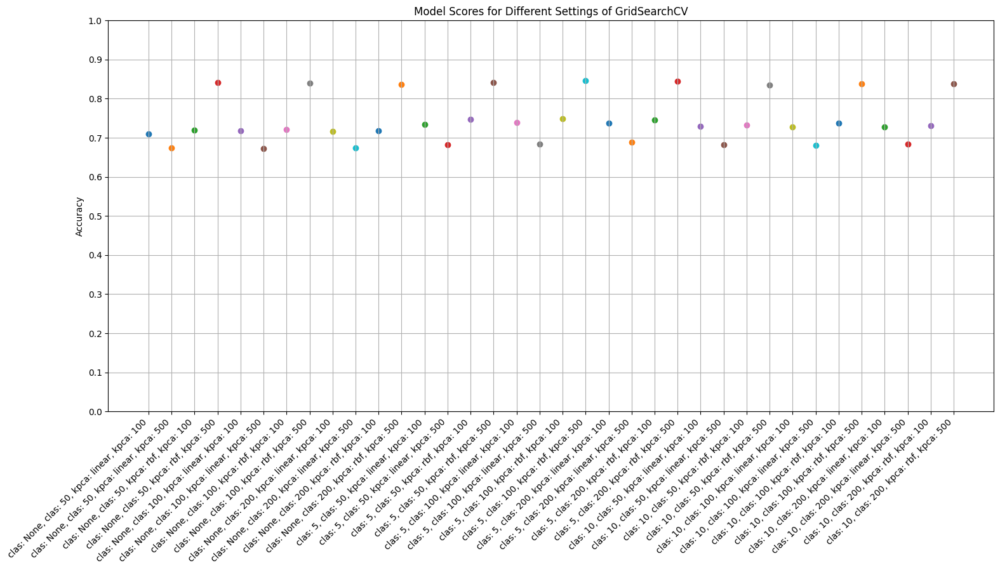

 

# Create Deep Learning Agents

As a next step, we created AI Agents using Deep Learning techniques particularly Convolutional Neural Networks.  
CNNs have proven to be one of the most efficient ways to classify images. They have a very strong advantage compared to other ML techniques, especially from standard NNs. They use convolutional filters which reduce massively the number of weights in the network, especially if we wanted to handle the images of the same resolution with a Fully Connected Network. Also, they can track topological information and neighboring regions much more efficiently, which makes them much more robust in transformations such as crop.
Finally, they can use data augmentation techniques which help them generalize better in the given dataset and be extremely robust in transformations introduced from the Random Agent.
 
In total 4 CNN models created to classify Rock-Scissor-Paper images with the following performance:
*    `Convolutional Neural Network (Vanilla Version)`: 87% accuracy in validation set
*    `Convolutional Neural Network (with L2 Regularization)`: 88% accuracy in validation set
*    `Convolutional Neural Network (with L2 regularization + Data Augmentation)`: 95% accuracy in validation set
*    `Convolutional Neural Network (all above + Transfer Learning)`: 99% accuracy in validation set

 

Accuracy of Best Convolutional Neural Network Classifier

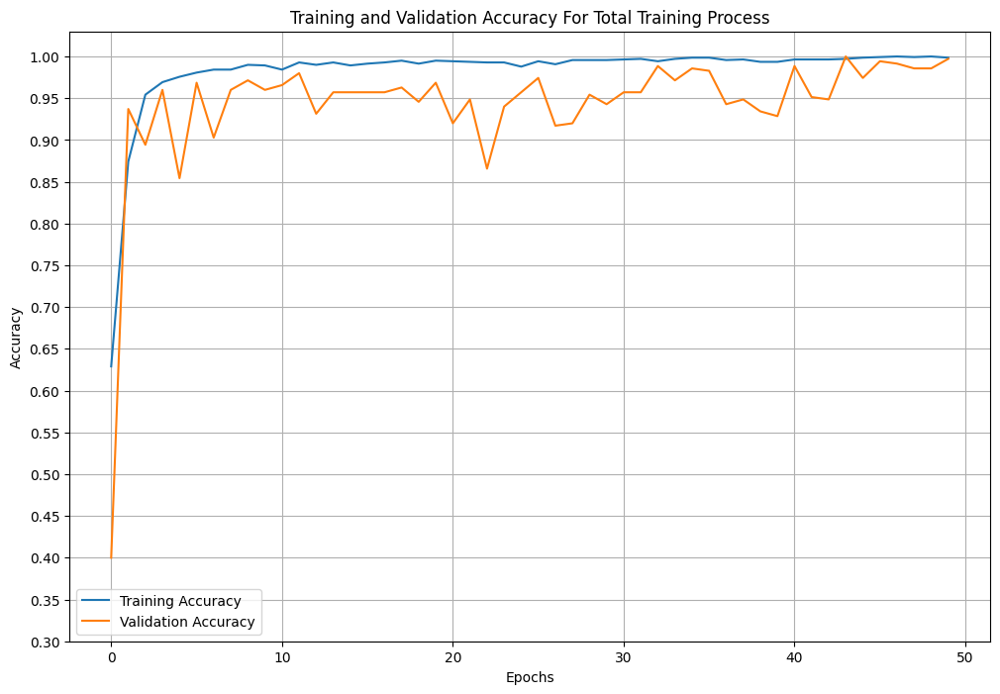

 

# RSP Game Environment
Create a simulated environment for Rock-Scissor-Paper game in order to deploy Agents and test their performance against Random Agent. A profit will be also calculated using the following rule:
*    If only AI Agent wins get 2 tokens.
*    If both Agents win get 1 token.
*    If only Random Agent wins lose 1 token.
*    If no Agent win nothing happens.

 

## Ensemble Agent in RSP Environment
Evaluation metrics:
*    Number of missclassified images from Ensemble Agent: 392
*    Number of missclassified images from both Agents: 278
*    Number of missclassified images only from Ensemble Agents: 114
*    Accuracy of Ensemble Agent: 60.8%
*    Accuracy of Random Agent: 32.2%

 

Profit of Ensemble Agent in RSP Environment

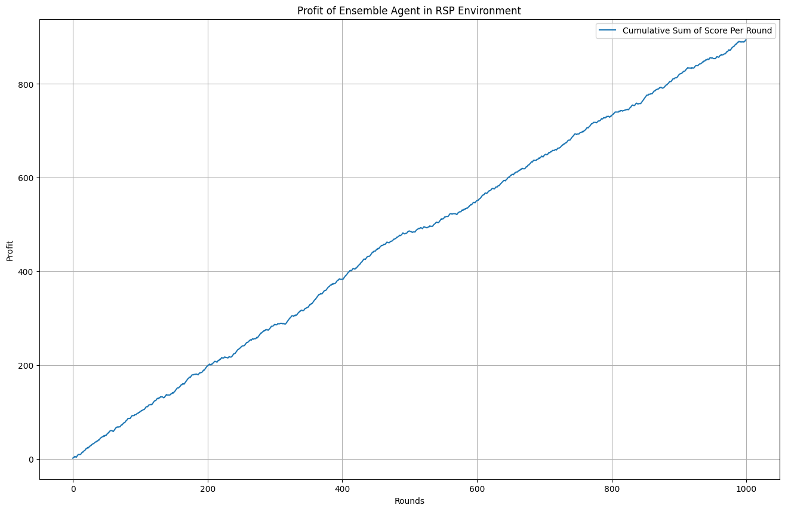

 

Examples of missclassified images from Ensemble Agent in RSP Environment

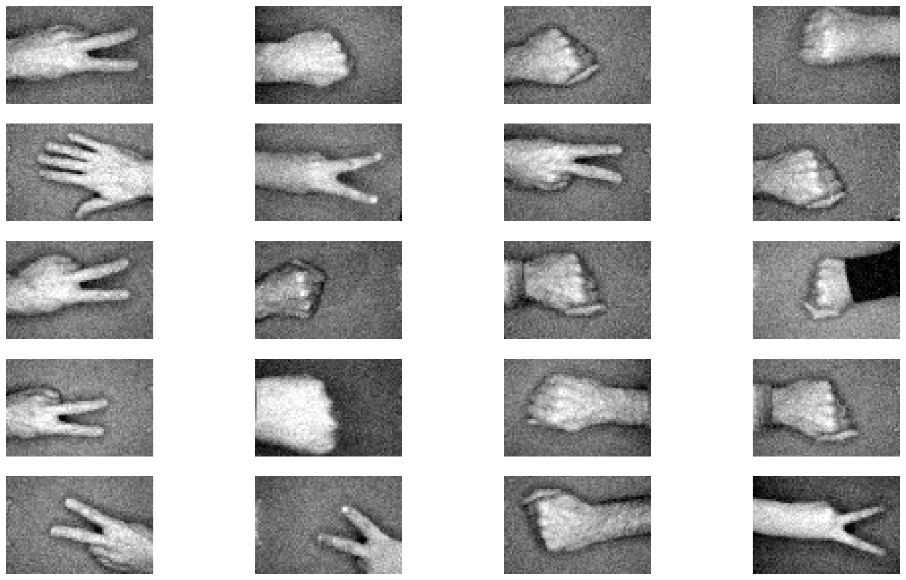

 

## CNN Agent (Top Performance Classifier) in RSP Environment
Evaluation metrics:
*    Number of missclassified images from CNN Agent: 36
*    Number of missclassified images from both Agents: 20
*    Number of missclassified images only from CNN Agents: 16
*    Accuracy of CNN Agent: 96.4%
*    Accuracy of Random Agent: 34.0%

 

Profit of CNN Agent (Top Performance Classifier) in RSP Environment

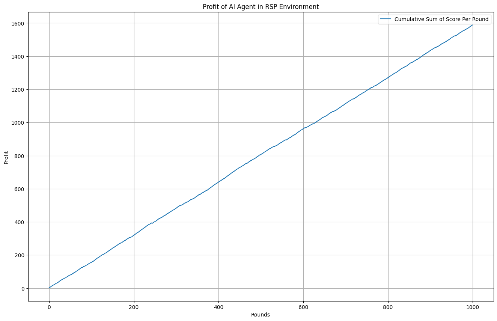

 

Examples of missclassified images from CNN Agent (Top Performance Classifier) in RSP Environment

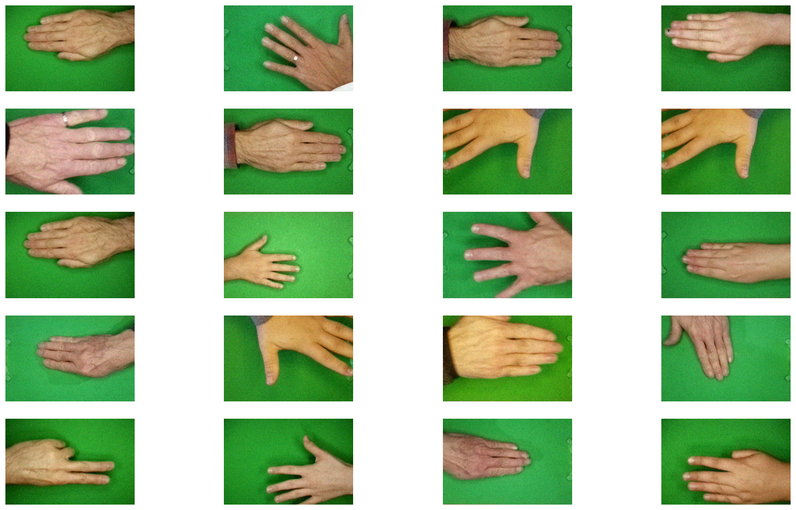

 

# Custom Dataset Evaluation with CNN Agent V4

 

Examples of custom dataset classification with CNN Agent (Top Performance Classifier)

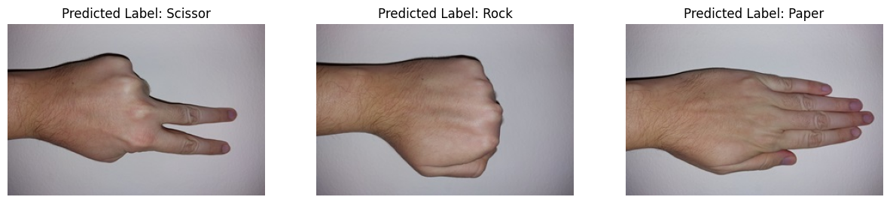

# Conclusion

To sum up the findings of the upper workflow, `the AI Agent V4 had an exceptional performance in the Rock-Scissor-Paper game resembled in RSP Environment with 96.4% accuracy achieved in the test set even after the transformation occurred from the Random Agent`. The AI Agent V4 had also approximately `99% accuracy in the test set without the transformations of the Random Agent`! The key ideas that helped the Random Agent V4 to outperform all the other agents were the Transfer Learning and Finetuning with the Xception model and of course, the Data Augmentation technique applied during training.  
However, for training such models the need for computational power was increased so it was important to train the CNN models in GPU, something that was not necessary for training the ML ensemble models.  
Regarding the ML models, their performance was limited compared to the DL models, something that we expected, due to the efficiency of CNN models to handle images as their input.  
Also, for the ML models, it was very important to work with images in Grayscale format and resize them to get a final vector of shape (3750,). The reshaping of the images to 1-dimensional vectors as explained earlier destroyed a significant part of the topological information of neighboring regions contained in the raw form of images and can be used from models like CNNs. With the CNN models, there was no need for such operations so all pixels were used, and all 3 channels of the RGB format. Dimensionality reduction algorithms were also used for the ensemble models to reduce even further the features of each sample. After all these techniques the ensemble models achieved a score of 88% in the validation set and approximately 60% in the RSP environment, a score far lower than from the CNN Agent.
"""

 

# Python Version and Necessary Libraries
*    python==3.10
*    tensorflow==2.15.0
*    matplotlib==3.7.1
*    scikit-learn==1.2.2
*    scipy==1.11.4
*    Pillow==9.4.0
*    pandas==1.5.3
*    numpy==1.23.5
*    keras==2.15.0
